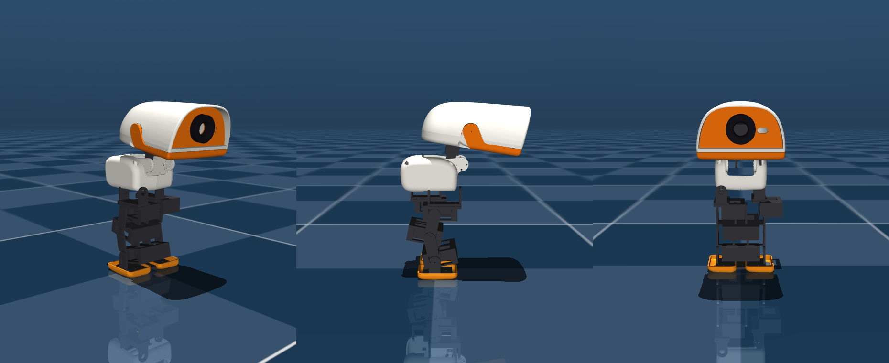

# NanoDuck — MG90S で成立する小型二足アヒル

[MicroDuck](https://github.com/pollen-robotics/microduck)（250 mm / 800 g /
Dynamixel XL330 ×14 / 約 63,000 円のサーボ）を、**ホビーサーボで作り直した**もの。

MicroDuck を縮小コピーしたのではない。一度そう試して**幾何的に成立しないことを確認した**
（§3）ので、MG90S の形と能力に合わせて引き直してある。

数値はカタログ値の掛け算ではなく、**実機出荷版の歩行ポリシー `alpha_walking.onnx` を
CPU MuJoCo で 30 秒走らせて実測した関節トルク・角速度**
（`analysis/microduck_demand.npz`、5348 サンプル × 14 関節）から導いている。

```
analysis/  design_point.py      設計点の決定（質量 × 脚長 × サーボ割当）
           servo_sizing.py      初期検討（相似縮小の限界。経緯として残す）
cad/       build_nanoduck.py    MJCF を生成し、静的バランスを検証
           check_servo_fit.py   実装密度の検証 ← 部品を買う前にこれ
sim/       nanoduck.xml         生成されたモデル（10 DOF, 241 g、実メッシュ入り）
           stand_test.py        MG90S で立てるか
           run_mg90s.py         MicroDuck を MG90S で走らせる（アクチュエータ検証）
bom/       bom.csv              部品表
```

```bash
python cad/build_nanoduck.py   # モデル生成 + バランス検証
python sim/stand_test.py       # 立つか
```



上は箱ではなく**実物のジオメトリ**です。白いシェル(頭・胴・水かき足)は
MicroDuck 本体のメッシュを縮小したもの、黒い脚は `cad/print/` の印刷部品そのもの。
質量と慣性を担う箱はグループ3に隠してあり、`geomgroup` を切り替えれば質量モデルが見えます。

---

## 1. 設計点

| | MicroDuck | **NanoDuck v2** |
|---|---|---|
| 全高 | 250 mm | **177 mm** (71 %) |
| 質量 | 800 g (MJCF 737 g) | **284 g** (36 %) |
| 全長 × 全幅 | — | 130 × 83 mm |
| DOF | 14 | **10** |
| サーボ | XL330 ×14 @7.4 V | MG92B ×2（膝）+ MG90S ×7 + マイクロ ×1 @6.0 V |
| 制御 | RK3566 / Linux | ESP32-S3-MINI-1 |
| サーボ費用 | 約 63,000 円 | **約 7,300 円** (1/9) |
| 脚長（腿+脛） | 91.6 mm | 50 mm |
| 最悪関節の使用率 | 76 %（膝） | **90 %**（膝） |

質量と寸法は見積りではなく `sim/nanoduck.xml` の実測。**モデルが正**。

MicroDuck 自身が「限界設計だが成立している」76 % に座っているので、そこを上限に
設計した。いまは **90 %** で、上限を超えている。

**「見た目クリソツ」の代償が積み上がった結果**:

| 段階 | 質量 | 最悪関節 |
|---|---|---|
| 構造だけ（見積り） | 196 g | 62 % |
| 印刷部品の実測 + 外装 | 241 g | 76 % |
| **頭を本家比率（0.85）に** | **284 g** | **90 %** |

頭を本家と同じ head/body = 1.52 にすると +43 g かかる。0.62 のままなら比 1.11 で
27 % 小さく、「アヒルだが何か違う」という見え方になっていた（§8）。
90 % は `design_point.py` の転写が MicroDuck の**機敏な歩容**を前提にした上界なので、
再学習した歩容ならもっと軽い。ただし余裕が無いのは事実で、
**軽くしたいならまず頭のスケールを下げる**のが一番効く。

高さが 71 % にしか下がらないのは、**サーボと電池が縮まないから**（§2）。
一方で質量は 27 %、サーボ費用は 11 % まで落ちる。
「小さくする」より「軽くする・安くする」プロジェクトだと理解した方が正しい。

---

## 2. 設計変数は「相似縮尺 s」ではなく「質量」と「脚長」

最初は MicroDuck を s 倍する枠組みで考えたが、これは**間違った定式化**だった。
一つの s が全部に掛かるため、関節が実際に気にしている 2 つの量が独立に動かせない。

関節需要の転写則:

```
τ = τ_micro · (M/M_micro) · (L_leg/L_micro)     (τ ~ M·g·L)
ω = ω_micro · √(L_micro/L_leg)                  (振子周期 ~ √(L/g))
P ~ τ·ω ~ M · √L_leg
```

**質量は 1 乗、脚長は 1/2 乗でしか効かない。**
脚を半分にして得られるのは出力予算の 29 %、質量を半分にすれば 50 %。
だから設計努力は mm ではなく **g** に注ぐ。

MG90S の脚が運べる質量（最悪関節 ≤ 100 %）:

| 脚長 | 全部 MG90S | 膝だけ MG92B |
|---|---|---|
| **50 mm** | 220 g | **315 g** ← 採用 |
| 70 mm | 205 g | 245 g |
| 100 mm | 170 g | 180 g |

脚を 70 → 50 mm に詰めたのは、造形の都合が先だった（70 mm では竹馬に乗った
ロボットに見えて、アヒルに見えなかった）。結果としてトルク予算も 245 → 315 g に
増えて、**見た目の判断と工学の判断が同じ方を向いた**。
代償は歩幅と地上高で、屋内 177 mm のロボットなら払える。

**膝 2 個を格上げする方が、機体をどう削るより効く。**
+0.8 g・+1,100 円で予算が 40 g 増える。ここに金を使う。

### 質量には床(floor)がある

サーボ・電池・基板は縮まない。s³ で縮むのは構造材だけ。
NanoDuck では **196 g のうち構造材は 33 g（17 %）**しかなく、残りは全部固定質量。
「もっと小さくすれば軽くなる」は、この規模ではもう成り立たない。

> 初期の見積りでは電池と基板を s³ 項に入れていた。450 mAh の LiPo は縮まないので、
> これは小スケールを不当に有利に見せる誤りだった。CAD メッシュの実測
> （`np_f970.stl` は名前に反し **NP-F550 寸法と 0.2 mm 一致** = 約 76 g）で
> 3 項モデルに組み直してある。

---

## 3. 縮小コピーが成立しなかった理由 — MG90S は「小さい」のではなく「薄い」

| | 長さ | 高さ | 幅 | 質量 |
|---|---|---|---|---|
| XL330-M288 | 34.0 mm | 29.0 mm | 20.0 mm | 18.0 g |
| MG90S（耳込み） | 32.2 mm | 28.5 mm | 12.2 mm | 13.4 g |
| 比 | **0.95** | **0.98** | 0.61 | 0.74 |

よく言われる「MG90S は XL330 の 45 % の体積」は事実だが**完全にミスリード**。
連鎖方向の長さが制約なので、効くのは長さで、そこは **5 % しか縮んでいない**。

MicroDuck の股関節は 3 DOF を 71 mm に詰めている = サーボ 1 個あたり 23.7 mm、
XL330 は 34 mm なので**既に 43 % 重なっている**。0.56 倍にすると、
実証済みの実装密度の **1.7 倍**が要る。トルクではなく実装が律速だった。

### 解決 — サーボを横に倒す

MG90S の出力軸は 22.8×12.2 面から出る。ピッチ関節では軸が左右方向を向くので、
**32.2 と 12.2 を矢状面内で自由に選べる**。12.2 を脚に沿わせれば:

| | 連鎖長/サーボ |
|---|---|
| サーボを連鎖に沿わせる（MicroDuck 流） | 40.2 mm |
| **サーボを横に倒す** | **20.2 mm** |

NanoDuck は腿 25 mm / 脛 25 mm なので実装密度 **0.81**（MicroDuck は 1.44）。
ブロッカーは取付向きだけで消えた。代償は腿が前後に 32 mm 張り出すこと —
アヒルなら「もも肉」に見えるので、制約とキャラクタが珍しく一致している。

詳細: [cad/README.md](cad/README.md) / `python cad/check_servo_fit.py`

---

## 4. MG90S アクチュエータモデル — 実装済み・検証済み

`sim/mg90s.py`。`sim/run_mg90s.py` が microduck_rl の `infer_policy.py` を
そのまま駆動し、**アクチュエータだけ**を差し替える。

```bash
cd sim
python run_mg90s.py --servo xl330      # 対照群
python run_mg90s.py --servo mg90s-6v   # 本命
python run_mg90s.py --servo mg90s-6v --view
```

MuJoCo の `position` アクチュエータを**トルクモードに変換**し、毎物理ステップで計算:

```
err  = deadband(q_target − q)          # ポテンショは出力軸を読む
u    = clip(kp·err / τ_stall, −1, +1)  # アナログP制御 → PWMデューティ
τ    = τ_stall·u − (τ_stall/ω_noload)·q̇
```

第 2 項の逆起電力が**トルク-速度の三角形**を作る。`position` の平坦な `forcerange`
では「速く回すほどトルクが出ない」を表現できず、ベンチでは崩れるロボットが
シム内では平然と歩いてしまう。

### 対照群による較正（これが無いと信用できない）

最初の実装は「誤差 1° でフルドライブ」= 実効剛性 55 Nm/rad とし、MJCF の
`chosen_actuator` が定める **kp = 0.55 Nm/rad の 100 倍**だった。
結果、**XL330 の数値でも 2.4 秒で転倒**。対照群が歩かないならモデルが悪い。

副産物として良い整合が出た: MJCF の `damping = 0.053` は逆起電力項を持たない
position モデル用の値なので逆起電力を吸収しているはず。実際
0.053 − (0.963/20.2) = **0.0054** で、BAM が独立にフィットした
`friction_viscous = 0.00536` と **1 % 以内で一致**する。

### 結果（MicroDuck 実寸・出荷版歩行ポリシー・15 s）

| サーボ | 結果 |
|---|---|
| XL330 @7.4 V（対照群） | **歩く** 2.65 m / 14.3 s、飽和 0 % |
| MG90S @6.0 V | **1.1 s で転倒**、飽和 64 % |

### アブレーション — 犯人は「関節剛性ひとつ」

MG90S は XL330 と**出力**と**制御則**の 2 点で違う。片方ずつ入れ替えると
実寸では**どちらも単独で致命的**（出力だけ → 1.7 s、制御則だけ → 1.9 s で転倒）。

制御則をさらに 3 要素に分解:

| 変更（XL330 の出力のまま） | 結果 |
|---|---|
| 不感帯 1.0° | **歩く**（飽和 0 %） |
| 指令遅延 20 ms（50 Hz PWM 1 フレーム） | **歩く** |
| kp 0.8 / 1.0 / 1.2 Nm/rad | **歩く** |
| kp 1.5 Nm/rad | 5.1 s で転倒 |
| **kp 2.47 Nm/rad**（MG90S 相当） | **0.8 s で転倒** |

**ハード設計への含意:**
- **333 Hz PWM は不要** — 標準 50 Hz の 20 ms 遅延は問題にならない
- **不感帯 1° も許容** — 姿勢精度は落ちるが安定性は壊さない
- **効くのは関節剛性ひとつ** — MG90S は自身のトルクに対し XL330 の約 4.5 倍硬い

ただしこれは**未再学習のポリシー**の話。RL は硬いアクチュエータを扱えるので、
kp ≈ 2.5 をドメインランダム化に含めて学習し直せば解ける見込みが高い。
結論は「MG90S は無理」ではなく**「再学習は必須で、そのとき剛性が最重要パラメータ」**。

---

## 5. 立てるか — 立てる（が、それは簡単な方の問題）

`python sim/stand_test.py`。ポリシー無しで STAND 姿勢を保持させ、重力をかける。

| サーボ | 結果 |
|---|---|
| XL330（対照群） | 立つ。たわみ 0.2 mm、rms 0.00 mm、飽和 0 % |
| **設計どおり（MG92B 膝 + MG90S + マイクロ）** | **立つ。たわみ 0.2 mm、飽和 0 %** |
| 全部 MG90S | 立つ。同上 |

不感帯 1° があってもリミットサイクルは出ず、静止する。

**ただしこれは簡単な方の問題**で、静的保持では 3 構成に差が出ない。
横から押すと 0.15 m/s でも全構成が転ぶが、そのとき**サーボは一度も飽和していない** —
つまりトルク不足ではなく**バランス制御が無いから**倒れている。
固定姿勢の保持に外乱復帰はできない。それはポリシーの仕事で、
`stand_test.py` はこの 2 つの失敗モードを区別して報告する。

**設計を本当に検証するのは、10 DOF で再学習した歩行ポリシー**。
`analysis/design_point.py` が心配しているのは遊脚期の出力であって、静止時の保持ではない。

### 最初のモデルは後ろに倒れた

ホームポーズに MicroDuck の関節角（腿 −26.2°、膝 ≈0、足首 +26.2°）を
数値のまま流用したのが原因。あれは**脚全体が前傾した**姿勢で、MicroDuck では
3 サーボの股関節クラスタが足を前に送り出して釣り合う。
単純な 2 軸股関節に入れると足が CoM より 31 mm 前に出て、後ろ向きに座り込む。

2 リンク脚で足首を股関節の真下に置く条件は **knee = −2·hip_pitch**、
足裏を水平にするのは **ankle = −(hip_pitch + knee)**。
いまはこれを式で導出しており、`build_nanoduck.py` が生成のたびに
**CoM が支持多角形に入っているか**を検証する（現在: 前後余裕 +16.2 mm、左右 +33.0 mm）。

---

## 6. 位置フィードバックが要る

観測 49 次元の内訳:

```
base_ang_vel(3) + gravity(3) + joint_pos(10) + joint_vel(10) + last_action(10) = 36
                                                            + command(13)      = 49
```

**関節エンコーダ由来が観測 36 次元中 20 次元**。MG90S は PWM 位置指令のみで出力を返さないので、
内部 5 kΩ ポテンショのワイパーを引き出す（[bom/README.md](bom/README.md) §4 に
落とし穴 3 つ: 分圧必須・低抵抗厳禁・コンデンサ容量）。

---

## 7. 残っている作業

1. **MG90S / MG92B のベンチ実測** — `sim/mg90s.py` の `kp`・不感帯・ストールトルクは
   推定値。シムの結論は kp に最も敏感なので、ここが最優先。
   MG92B のカタログ値はベンダー間でばらつきが大きく、設計はこれに依存している
2. **再学習** — `Mjlab-Velocity-Flat-NanoDuck` を登録し、MG90S アクチュエータモデルと
   kp のドメインランダム化を入れて PPO。観測 49 / 行動 10 の新しい契約になる
3. **機構設計** — サーボ横倒しレイアウトで実際に CAD を引く。
   `sim/nanoduck.xml` は箱を並べた運動学モデルであって、製造できる形状ではない。
   Onshape の MicroDuck は公開されている（[cad/README.md](cad/README.md)）が、
   参照用であって派生元にはしない
4. **ESP32-S3 への載せ替え** — 49→128→128→10 なら 23k パラメータ = 92 KB で
   量子化なしに内蔵 SRAM に載る

---

## ライセンス

上流 microduck_rl と同じ 2 分割構成:

- **コード** (`analysis/`, `sim/*.py`, `cad/*.py`, ドキュメント) — [Apache 2.0](LICENSE)
- **3D モデル** (`cad/microduck_src/`) — **CC BY-NC-SA 4.0**。
  Pollen Robotics の [microduck_rl](https://github.com/pollen-robotics/microduck_rl)
  からのコピーで、**商用利用不可・継承必須**。派生物である
  `analysis/microduck_demand.npz` も同条件

詳細と、なぜこれらのファイルを同梱しているかは [NOTICE.md](NOTICE.md)。

本家は Pollen Robotics の [MicroDuck](https://pollen-robotics.com/microduck)。
NanoDuck は非公式の独立リデザインで、Pollen Robotics とは関係ありません。

---

## 8. 頭部まわりの監査（未解決を含む）

### 比率 — 直した

MicroDuck の head/body 比は **1.52**。頭 0.62 / 胴 0.85 と別スケールにしていたため
NanoDuck は **1.11** で、27 % 小さかった。これが「アヒルだが何か違う」の正体。
頭を胴と同じ 0.85 にして 1.52 を厳密に回復した（+43 g、膝 76 → 90 %）。

### head_yaw の駆動 — 足りていなかった

`design_point.py` は頭の関節需要も**脚長でスケール**していた。首サーボが支えるのは
脚ではなく頭なので、これは誤り。頭のスケールで転写し直すと:

| | 旧（脚スケール） | 新（頭スケール） |
|---|---|---|
| head_yaw 必要トルク | 0.038 Nm | **0.050 Nm** |
| マイクロ 3.7 g の使用率 | 83 % | **102 %（成立しない）** |

→ head_yaw を **MG90S に格上げ**（27 %）。neck_pitch はマイクロのままでよい（34 %）—
こちらは短いアームで重力に抗するだけで、頭の慣性を振り回さない。

### センサ — 穴はあるが中身が無い

| | MicroDuck | NanoDuck |
|---|---|---|
| サイト | imu, imu_bno, head_camera, mouth_tip, tof, head_imu | imu, head_camera, **tof**, **head_imu**, mouth_tip |
| 実カメラ | RPi カメラ + M12 レンズ | **無し（`ncam = 0`）** |
| ToF | 有り | **無し** |

サイトは MicroDuck と同じ名前で揃えた（歩行の観測は胴の IMU だけなので機能上は不要だが、
外装が MicroDuck 製で**穴が開いている**以上、位置はモデルに書いておくべき）。

**未解決**: 頭のシェルにはレンズ穴と ToF 窓があるのに、BOM には何も入っていない。
どちらかを選ぶ必要がある:
- **目隠しプラグを印刷する**（軽い。歩行には何も要らない）
- **OV2640 等を積む**（ESP32-S3 で駆動可。ただし §3 の「歩行だけ」という前提が変わる）

### 腰まわり — サーボは全部ある。フレームが無い

`cad/build_nanoduck.py` の `check_joints()` で確認済み:

- サーボ 10 個すべてモデルに存在（hip_roll ×2 と neck_pitch は胴に載っている）
- 軸の向き、ホームが範囲内、キーフレーム一致、ctrlrange 一致、左右の鏡像性、
  膝の符号（足首が股関節の真下 ±0.00 mm）— **全項目合格**

**未解決**: hip_roll サーボ 2 個を保持する**胴体シャーシがまだ描かれていない**。
質量 12 g で見積もってあるだけで、印刷部品が無い。
`cad/print/` に無い唯一の構造部品で、ここが腰まわりの本当の穴。

### 首まわり — 3 件とも実バグだった

「首まわりがおかしい」で見つかったもの:

1. **首の印刷部品が上下逆** — `parts.link()` は全部品を「駆動側が −Z」で作る。
   脚 6 部品はこれで正しいが、首だけは **+Z**（頭は上）。
   部品は z = −44〜+5 に伸びていて、**頭のある上ではなく胴の中へ向いていた**。
   親の部品が自分の駆動する関節位置に届いているかを検証する
   `check_joints()` の到達テストで検出（脚 6 部品は合格、首だけ不合格）。

2. **頭が胴に 10.6 mm めり込んでいた** — これが「首が見えない」の正体。
   首が無いのではなく、頭が胴の中にあった。`NECK_SINK = 8` と `HEAD_Z = 4` は
   37 mm の頭には妥当だったが、0.85 で 50 mm になった頭には過補正。
   いまは**閉形式で導出せず測って収束させている**（`solve_head_z()`）—
   閉形式は 2 回間違えた（neck_pitch の傾きで頭の底面が下がる分、
   クラスタの重心が最下点ではない分を、どちらも落としていた）。
   `check_head_clearance()` がコンパイル済みモデルから実測する。

3. **色が無かった** — シェルは別部品なので個別に着色できる。実物は
   オフホワイト + **オレンジのくちばしと眉帯** + 黒い目。
   単色クリームだと「白い汎用ロボット」に見えてしまう。

なお「頭が 40° 傾いて見える」は**目視の誤り**で、実測ピッチは **+8.6°**
（= `NECK_PITCH_0` そのまま）。見えていた傾きは MicroDuck 自身の楔形の頭蓋。

### 腰まわり — 軸が平行だった（`8d6f5fb` で修正済み）

hip_roll と hip_pitch は**直交**しなければならないが、平行になっていた。
いま股関節は 2 部品のコーナーリンク（`hip_yoke_a` + `hip_yoke_b`）で、
`check_joints()` が軸の向きを検証している。

**未解決のまま**: hip_roll サーボ 2 個を保持する胴体シャーシは依然として未描画。
`cad/print/` に無い唯一の構造部品。
